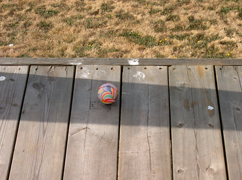
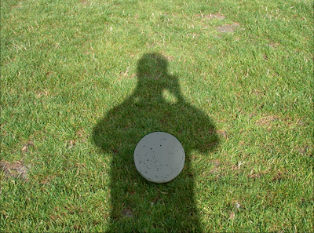
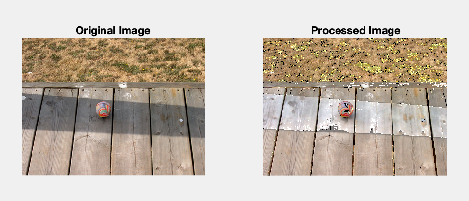
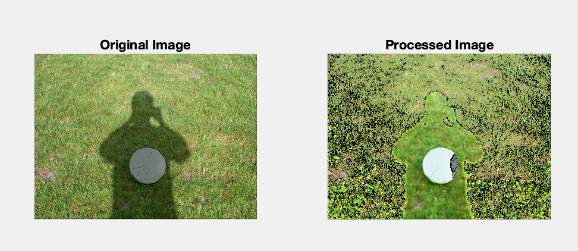

# Shadow-Removal-Using-MATlab
A image processing Project based on Shadow Detection and darkness removal by equilizing intensity difference.

This project is developed in 6 sem, as mini project.

#Original Image

 
#Processed Imaged

