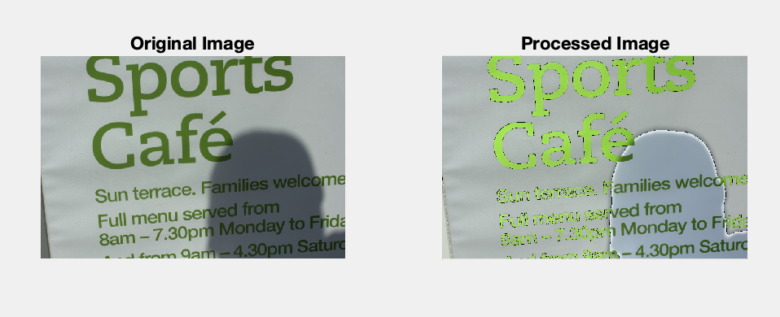

# Shadow-Removal-Using-MATlab
A image processing Project based on Shadow Detection and darkness removal by equilizing intensity difference.

This project is developed in 6 sem, as mini project.

This sample data is low resolution colour images.

<h2>#Original Image Vs #Processed Imaged</h2>

 

 

I request you to give feedback, or give more accurate result's if possible.
